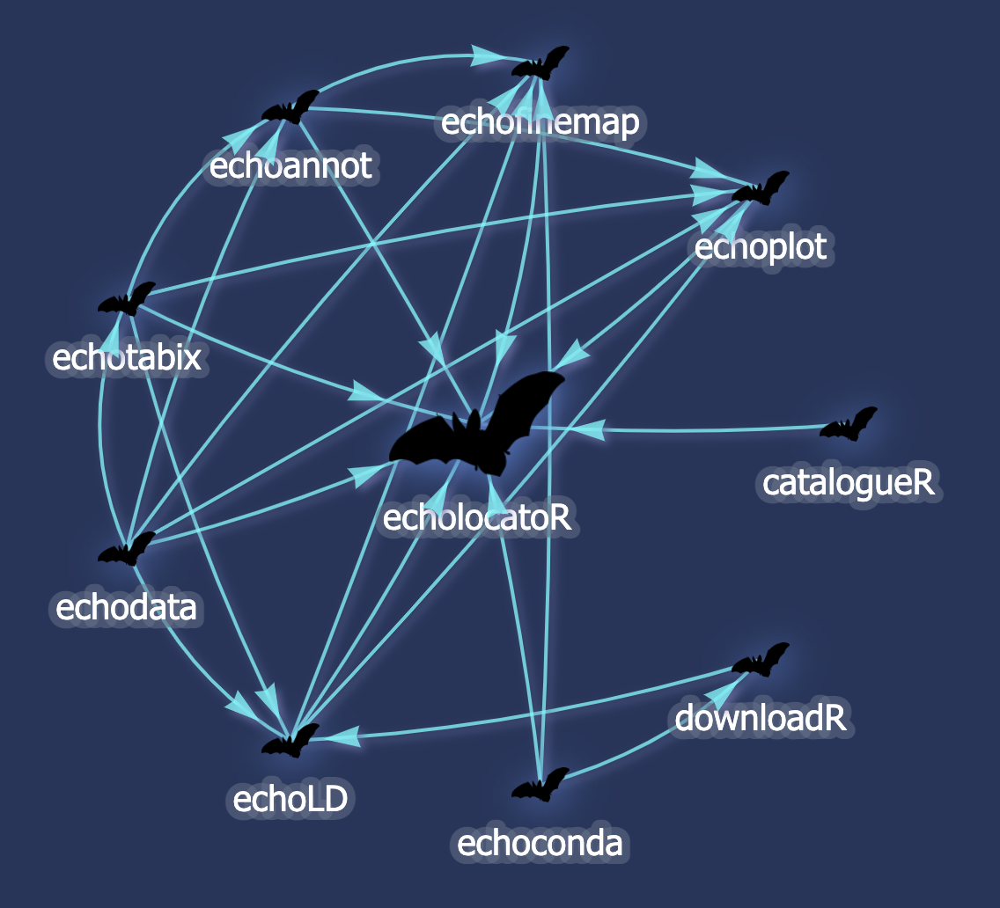

```{r, echo=FALSE, include=FALSE}
pkg <- read.dcf("DESCRIPTION", fields = "Package")[1]
description <- read.dcf("DESCRIPTION", fields = "Description")[1]
```
 
## ``r pkg``: `r gsub("echoverse module: ","", description)`


### The *echoverse* 

``r pkg`` is part of the [__*echoverse*__](https://github.com/topics/echoverse), a suite of R packages designed to facilitate different steps in genetic fine-mapping. 

``r pkg`` calls each of these other packages (i.e. "modules") internally to create a unified pipeline. However, you can also use each module independently to create your own custom workflows. 

#### __*echoverse*__ dependency graph 

 

> Made with [`echodeps`](https://github.com/RajLabMSSM/echodeps), yet another __*echoverse*__ module. See [here for the interactive version](https://rajlabmssm.github.io/Fine_Mapping/echolocatoR.dep_graph.html) with package descriptions and links to each GitHub repo.  


### Citation 

If you use ``r pkg``, or any of the _*echoverse*_ subpackages, please cite: 

> `r citation(pkg)$textVersion`


## Introduction

Fine-mapping methods are a powerful means of identifying causal variants
underlying a given phenotype, but are underutilized due to the technical
challenges of implementation. ***echolocatoR*** is an R package that
automates end-to-end genomics fine-mapping, annotation, and plotting in
order to identify the most probable causal variants associated with a
given phenotype.

It requires minimal input from users (a GWAS or QTL summary statistics
file), and includes a suite of statistical and functional fine-mapping
tools. It also includes extensive access to datasets (linkage
disequilibrium panels, epigenomic and genome-wide annotations, QTL).

The elimination of data gathering and preprocessing steps enables rapid
fine-mapping of many loci in any phenotype, complete with locus-specific
publication-ready figure generation. All results are merged into a
single per-SNP summary file for additional downstream analysis and
results sharing. Therefore ***echolocatoR*** drastically reduces the
barriers to identifying causal variants by making the entire
fine-mapping pipeline rapid, robust and scalable.


## Installation 

```R
if(!require("remotes")) install.packages("remotes")

remotes::install_github("RajLabMSSM/`r pkg`@echoverse")
library(`r pkg`)
```


## Documentation 

### [Website](https://rajlabmssm.github.io/`r pkg`) 
### [Getting started](https://rajlabmssm.github.io/`r pkg`/articles/`r pkg`) 

### Bugs/requests

Please report any bugs/requests on [GitHub Issues](https://github.com/RajLabMSSM/echolocatoR/issues).

[Contributions](https://github.com/RajLabMSSM/echolocatoR/pulls) are welcome!

## Literature
 
### For applications of ***echolocatoR*** in the literature, please see:

> 1.	E Navarro, E Udine, K de Paiva Lopes, M Parks, G Riboldi, BM Schilder…T Raj (2020) Dysregulation of mitochondrial and proteo-lysosomal genes in Parkinson's disease myeloid cells. Nature Genetics. https://doi.org/10.1101/2020.07.20.212407 
> 2.	BM Schilder, T Raj (2021) Fine-Mapping of Parkinson’s Disease Susceptibility Loci Identifies Putative Causal Variants. Human Molecular Genetics, ddab294, https://doi.org/10.1093/hmg/ddab294   
> 3. K de Paiva Lopes, G JL Snijders, J Humphrey, A Allan, M Sneeboer, E Navarro, BM Schilder…T Raj (2022) Genetic analysis of the human microglial transcriptome across brain regions, aging and disease pathologies. Nature Genetics, https://doi.org/10.1038/s41588-021-00976-y  


## `echofinemap`: Fine-mapping tools

***echolocatoR*** will automatically check whether you have the
necessary columns to run each tool you selected in
`echolocatoR::finemap_loci(finemap_methods=...)`.
It will remove any tools that for
which there are missing necessary columns, and produces a message
letting you know which columns are missing. Note that some columns (e.g.
`MAF`,`N`,`t-stat`) can be automatically inferred if missing.  
For easy reference, we list the necessary columns here as well.  
See `?finemap_loci()` for descriptions of these columns.  
All methods require the columns: `SNP`,`CHR`,`POS`,`Effect`,`StdErr`

Additional required columns:

```{r}
knitr::kable(echofinemap::required_cols())
```


### [ABF](https://cran.r-project.org/web/packages/coloc/vignettes/vignette.html)

### [FINEMAP](http://www.christianbenner.com)

### [SuSiE](https://github.com/stephenslab/susieR)

### [PolyFun](https://github.com/omerwe/polyfun)

### [PAINTOR](https://github.com/gkichaev/PAINTOR_V3.0)

### [GCTA-COJO](https://cnsgenomics.com/software/gcta/#COJO)

### [coloc](https://cran.r-project.org/web/packages/coloc/vignettes/vignette.html)

<br>

## Multi-finemap results files

The main output of ***echolocatoR*** are the multi-finemap files (for
example, `echodata::BST1`). They are stored in the locus-specific
*Multi-finemap* subfolders.

### Column descriptions

-   **Standardized GWAS/QTL summary statistics**: e.g.
    `SNP`,`CHR`,`POS`,`Effect`,`StdErr`. See `?finemap_loci()` for
    descriptions of each.  
-   **leadSNP**: The designated proxy SNP per locus, which is the SNP
    with the smallest p-value by default.
-   **\<tool\>.CS**: The 95% probability Credible Set (CS) to which a
    SNP belongs within a given fine-mapping tool's results. If a SNP is
    not in any of the tool's CS, it is assigned `NA` (or `0` for the
    purposes of plotting).  
-   **\<tool\>.PP**: The posterior probability that a SNP is causal for
    a given GWAS/QTL trait.  
-   **Support**: The total number of fine-mapping tools that include the
    SNP in its CS.
-   **Consensus_SNP**: By default, defined as a SNP that is included in
    the CS of more than `N` fine-mapping tool(s), i.e. `Support>1`
    (default: `N=1`).  
-   **mean.PP**: The mean SNP-wise PP across all fine-mapping tools
    used.
-   **mean.CS**: If mean PP is greater than the 95% probability
    threshold (`mean.PP>0.95`) then `mean.CS` is 1, else 0. This tends
    to be a very stringent threshold as it requires a high degree of
    agreement between fine-mapping tools.

### Notes

-   Separate multi-finemap files are generated for each LD reference
    panel used, which is included in the file name (e.g.
    *UKB_LD.Multi-finemap.tsv.gz*).

-   Each fine-mapping tool defines its CS and PP slightly differently,
    so please refer to the associated original publications for the
    exact details of how these are calculated (links provided above).


## Datasets

Datasets are now stored/retrieved via the following **echoverse** sub-packages.

For more detailed information about each dataset, use `?`:  
```R  
library(echoannot)   
?NOTT_2019.interactome # epigenomic annotations

library(echodata) 
?BST1 # fine-mapping results 
```

### `echoannot`: Epigenomic & genome-wide annotations

#### [Nott et al. (2019)](https://science.sciencemag.org/content/366/6469/1134.abstract)

-   Data from this publication contains results from cell type-specific
    (neurons, oligodendrocytes, astrocytes, microglia, & peripheral
    myeloid cells) epigenomic assays (H3K27ac, ATAC, H3K4me3) from human
    brain tissue.

#### [XGR](http://xgr.r-forge.r-project.org)

-   API access to a diverse library of cell type/line-specific
    epigenomic (e.g. ENCODE) and other genome-wide annotations.

#### [Roadmap](http://www.roadmapepigenomics.org)

-   API access to cell type-specific epigenomic data.

#### [biomaRt](https://bioconductor.org/packages/release/bioc/html/biomaRt.html)

-   API access to various genome-wide SNP annotations (e.g. missense,
    nonsynonmous, intronic, enhancer).

#### [HaploR](https://cran.r-project.org/web/packages/haploR/vignettes/haplor-vignette.html)

-   API access to known per-SNP QTL and epigenomic data hits.

### `catalogueR`: QTLs

#### [eQTL Catalogue](https://www.ebi.ac.uk/eqtl/)

-   API access to full summary statistics from many standardized
    e/s/t-QTL datasets.  
-   Data access and colocalization tests facilitated through the
    [catalogueR](https://github.com/RajLabMSSM/catalogueR) R package.

<br>

## Enrichment tools

### [XGR](http://xgr.r-forge.r-project.org)

-   Binomial enrichment tests between customisable foreground and
    background SNPs.

### [GoShifter](https://github.com/immunogenomics/goshifter)

-   LD-informed iterative enrichment analysis.

### [S-LDSC](https://www.nature.com/articles/ng.3954)

-   Genome-wide stratified LD score regression.
-   Inlccles 187-annotation baseline model from [Gazal et al.
    2018](https://www.nature.com/articles/s41588-018-0231-8).  
-   You can alternatively supply a custom annotations matrix.

### [motifbreakR](https://github.com/Simon-Coetzee/motifBreakR)

-   Identification of transcript factor binding motifs (TFBM) and
    prediction of SNP disruption to said motifs.
-   Includes a comprehensive list of TFBM databases via
    [MotifDB](https://bioconductor.org/packages/release/bioc/html/MotifDb.html)
    (9,900+ annotated position frequency matrices from 14 public
    sources, for multiple organisms).

### [GARFIELD](https://www.bioconductor.org/packages/release/bioc/html/garfield.html) (**under construction**)

-   Genomic enrichment with LD-informed heuristics.

<br>

## `echoLD`: LD reference panels

### [UK Biobank](https://www.ukbiobank.ac.uk)

### [1000 Genomes Phase 1](https://www.internationalgenome.org)

### [1000 Genomes Phase 3](https://www.internationalgenome.org)


<hr>

## Contact

<a href="https://bschilder.github.io/BMSchilder/" target="_blank">Brian
M. Schilder, Bioinformatician II</a>  
<a href="https://rajlab.org" target="_blank">Raj Lab</a>  
<a href="https://icahn.mssm.edu/about/departments/neuroscience" target="_blank">Department
of Neuroscience, Icahn School of Medicine at Mount Sinai</a>  

<br>

# Session info  

<details>

```{r Session Info, attr.output='style="max-height: 200px;"'}
utils::sessionInfo()
```

</details>

