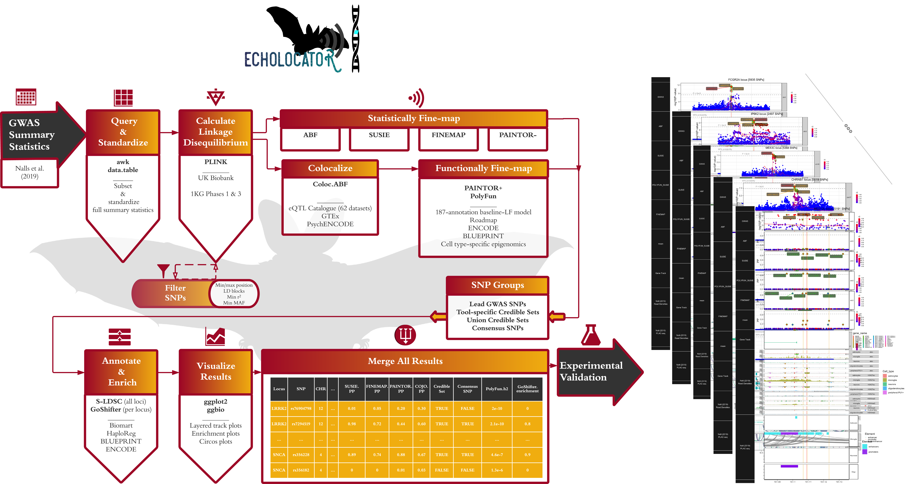

# )))))))   *echolocatoR*   (((((((
Automated statistical and functional fine-mapping pipeline with extensive API access to datasets.  

*echolocatoR* is available as an R package.  

## Installation  

To install, run the following command in R:  
```R
devtools::install_github("RajLabMSSM/echolocatoR")
```

## Workflow  



## Fine-mapping Tools  

### Currently implemented  
- [ABF](https://cran.r-project.org/web/packages/coloc/vignettes/vignette.html)  
- [susieR](https://github.com/stephenslab/susieR)  
- [FINEMAP](http://www.christianbenner.com)  
- [Polyfun+SusieR](https://github.com/omerwe/polyfun)
- [GCTA-COJO](https://cnsgenomics.com/software/gcta/#COJO)
- [PAINTOR](https://github.com/gkichaev/PAINTOR_V3.0)  
- [coloc](https://cran.r-project.org/web/packages/coloc/vignettes/vignette.html)


<br>


## Datasets

### Epigenomic & Genome-wide Annotations

#### [Nott et al. (2019)](https://science.sciencemag.org/content/366/6469/1134.abstract)
- API access to cell type-specific epigenomics from brain tissue, including:    
  + Epigenomic reads (as *GenomicRanges*)
  + Enhancer/promoter coordinates (as *GenomicRanges*)
  + PLAC-seq enhancer-promoter interactome   
  
#### [XGR](http://xgr.r-forge.r-project.org)    
- API access to a diverse library of cell type/line-specific epigenomic (e.g. ENCODE) and other genome-wide annotations.    
#### [Roadmap](http://www.roadmapepigenomics.org)  
- API access to cell type-specific epigenomic data.  

#### [biomaRt](https://bioconductor.org/packages/release/bioc/html/biomaRt.html)  
- API access to various genome-wide SNP annotations (e.g. missense, nonsynonmous, intronic, enhancer).  

#### [HaploR](https://cran.r-project.org/web/packages/haploR/vignettes/haplor-vignette.html)  
- API access to known per-SNP QTL and epigenomic data hits.  

### QTLs

#### [eQTL Catalogue](https://www.ebi.ac.uk/eqtl/)  
- API access to full summary statistics from many standardized e/s/t-QTL datasets.  
- Data access and colocalization tests facilitated through the [catalogueR](https://github.com/RajLabMSSM/catalogueR) R package.  

<br>


## Enrichment Tools

### [XGR](http://xgr.r-forge.r-project.org)   
- Binomial enrichment tests between customisable foreground and background SNPs.  

### [GoShifter](https://github.com/immunogenomics/goshifter)  
- LD-informed iterative enrichment analysis.

### [S-LDSC](https://www.nature.com/articles/ng.3954)
- Genome-wide stratified LD score regression.
- Inlcudes 187-annotation baseline model from [Gazal et al. 2018](https://www.nature.com/articles/s41588-018-0231-8).  
- You can alternatively supply a custom annotations matrix.

### [GARFIELD](https://www.bioconductor.org/packages/release/bioc/html/garfield.html) (**under construction**)
- Genomic enrichment with LD-informed heuristics.   


<br>


## LD Reference Panels  

### [UK Biobank](https://www.ukbiobank.ac.uk)
### [1000 Genomes Phase 1](https://www.internationalgenome.org)  
### [1000 Genomes Phase 3](https://www.internationalgenome.org)  


<hr><hr>

## Author

<a href="https://bschilder.github.io/BMSchilder/" target="_blank">Brian M. Schilder, Bioinformatician II</a>  
<a href="https://rajlab.org" target="_blank">Raj Lab</a>  
<a href="https://icahn.mssm.edu/about/departments/neuroscience" target="_blank">Department of Neuroscience, Icahn School of Medicine at Mount Sinai</a>  

