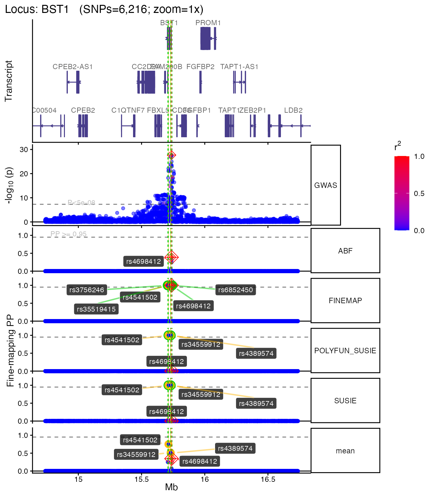
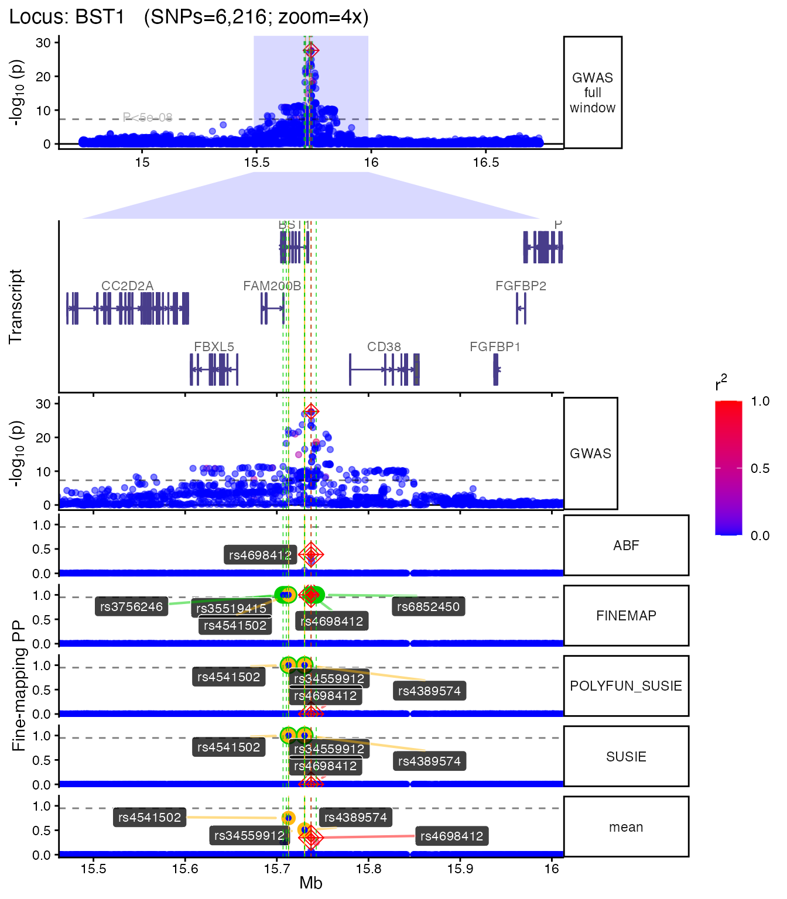
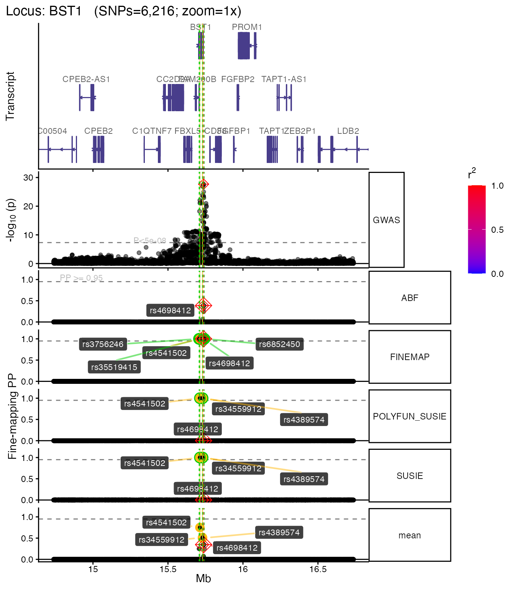

# Plotting fine-mapping results

``` r
library(echolocatoR)
```

    ## 

    ## ── 🦇  🦇  🦇 e c h o l o c a t o R 🦇  🦇  🦇 ─────────────────────────────────

    ## 

    ## ── v2.0.5 ──────────────────────────────────────────────────────────────────────

    ## 

    ## ────────────────────────────────────────────────────────────────────────────────

    ## ⠊⠉⠡⣀⣀⠊⠉⠡⣀⣀⠊⠉⠢⣀⡠⠊⠉⠢⣀⡠⠊⠉⠢⣀⡠⠊⠉⠢⣀⡠⠊⠉⠢⣀⡠⠊⠉⠢⣀⡠                                    
    ## ⠌⢁⡐⠉⣀⠊⢂⡐⠑⣀⠊⢂⡐⠑⣀⠊⢂⡐⠑⣀⠊⢂⡐⠑⣀⠊⢂⡐⠑⣀⠉⢂⡈⠑⣀⠉⢄⡈⠡⣀                                    
    ## ⠌⡈⡐⢂⢁⠒⡈⡐⢂⢁⠒⡈⡐⢂⢁⠑⡈⡈⢄⢁⠡⠌⡈⠤⢁⠡⠌⡈⠤⢁⠡⠌⡈⡠⢁⢁⠊⡈⡐⢂                                    
    ## ⠌⡈⡐⢂⢁⠒⡈⡐⢂⢁⠒⡈⡐⢂⢁⠑⡈⡈⢄⢁⠡⠌⡈⠤⢁⠡⠌⡈⠤⢁⠡⠌⡈⡠⢁⢁⠊⡈⡐⢂                                    
    ## ⠌⢁⡐⠉⣀⠊⢂⡐⠑⣀⠊⢂⡐⠑⣀⠊⢂⡐⠑⣀⠊⢂⡐⠑⣀⠊⢂⡐⠑⣀⠉⢂⡈⠑⣀⠉⢄⡈⠡⣀                                    
    ## ⠊⠉⠡⣀⣀⠊⠉⠡⣀⣀⠊⠉⠢⣀⡠⠊⠉⠢⣀⡠⠊⠉⠢⣀⡠⠊⠉⠢⣀⡠⠊⠉⠢⣀⡠⠊⠉⠢⣀⡠                                    
    ## ⓞ If you use echolocatoR or any of the echoverse subpackages, please cite:      
    ##      ▶ Brian M Schilder, Jack Humphrey, Towfique                                
    ##      Raj (2021) echolocatoR: an automated                                       
    ##      end-to-end statistical and functional                                      
    ##      genomic fine-mapping pipeline,                                             
    ##      Bioinformatics; btab658,                                                   
    ##      https://doi.org/10.1093/bioinformatics/btab658                             
    ## ⓞ Please report any bugs/feature requests on GitHub:
    ##      ▶
    ##      https://github.com/RajLabMSSM/echolocatoR/issues
    ## ⓞ Contributions are welcome!:
    ##      ▶
    ##      https://github.com/RajLabMSSM/echolocatoR/pulls

``` r
can_plot <- tryCatch({
    requireNamespace("echoplot", quietly = TRUE) &&
    requireNamespace("ggplot2", quietly = TRUE) &&
    requireNamespace("patchwork", quietly = TRUE)
}, error = function(e) FALSE)
```

## Overview

`echoplot` provides multi-track locus plots that combine GWAS
association signals, fine-mapping posterior probabilities, LD structure,
and gene models in a single figure. This vignette demonstrates common
plotting workflows using bundled example data — **no internet connection
is required**.

For the full fine-mapping pipeline, see
[`vignette("echolocatoR")`](https://rajlabmssm.github.io/echolocatoR/articles/echolocatoR.md).
For interpreting results, see
[`vignette("explore_results")`](https://rajlabmssm.github.io/echolocatoR/articles/explore_results.md).

## Load example data

``` r
dat <- echodata::BST1
LD_matrix <- echodata::BST1_LD_matrix
locus_dir <- file.path(tempdir(), echodata::locus_dir)
```

## Basic locus plot

The main function
[`echoplot::plot_locus()`](https://rdrr.io/pkg/echoplot/man/plot_locus.html)
creates a multi-panel figure with GWAS p-values, fine-mapping posterior
probabilities, and gene tracks. SNPs are colored by LD r² with the lead
SNP.

``` r
plt <- tryCatch(
    echoplot::plot_locus(
        dat = dat,
        locus_dir = locus_dir,
        LD_matrix = LD_matrix,
        show_plot = FALSE,
        save_plot = FALSE,
        verbose = FALSE
    ),
    error = function(e) { message("plot_locus error: ", e$message); NULL }
)
```

    ## + support_thresh = 2

    ## + Calculating mean Posterior Probability (mean.PP)...

    ## + 4 fine-mapping methods used.

    ## + 7 Credible Set SNPs identified.

    ## + 3 Consensus SNPs identified.

    ## + Filling NAs in CS cols with 0.

    ## + Filling NAs in PP cols with 0.

    ## Loading required namespace: ggrepel

    ## Loading required namespace: EnsDb.Hsapiens.v75

    ## Fetching data...OK
    ## Parsing exons...OK
    ## Defining introns...OK
    ## Defining UTRs...OK
    ## Defining CDS...OK
    ## aggregating...
    ## Done
    ## Constructing graphics...
    ## + echoplot:: Get window suffix...

``` r
if (!is.null(plt)) plt[["1x"]]
```



## Customizing the plot

### Multiple zoom levels

You can generate plots at different zoom levels to focus on the
fine-mapped region:

``` r
plt_zoom <- tryCatch(
    echoplot::plot_locus(
        dat = dat,
        locus_dir = locus_dir,
        LD_matrix = LD_matrix,
        zoom = c("1x", "4x"),
        show_plot = FALSE,
        save_plot = FALSE,
        verbose = FALSE
    ),
    error = function(e) { message("plot_locus error: ", e$message); NULL }
)
```

    ## + support_thresh = 2

    ## + Calculating mean Posterior Probability (mean.PP)...

    ## + 4 fine-mapping methods used.

    ## + 7 Credible Set SNPs identified.

    ## + 3 Consensus SNPs identified.

    ## + Filling NAs in CS cols with 0.

    ## + Filling NAs in PP cols with 0.

    ## Fetching data...OK
    ## Parsing exons...OK
    ## Defining introns...OK
    ## Defining UTRs...OK
    ## Defining CDS...OK
    ## aggregating...
    ## Done
    ## Constructing graphics...
    ## + echoplot:: Get window suffix...
    ## + echoplot:: Get window suffix...
    ## + Constructing zoom polygon...
    ## + Highlighting zoom origin...

``` r
if (!is.null(plt_zoom)) plt_zoom[["4x"]]
```



### Without LD coloring

If you don’t have an LD matrix, the plot still works — SNPs are shown
without r² coloring:

``` r
plt_nold <- tryCatch(
    echoplot::plot_locus(
        dat = dat,
        locus_dir = locus_dir,
        LD_matrix = NULL,
        show_plot = FALSE,
        save_plot = FALSE,
        verbose = FALSE
    ),
    error = function(e) { message("plot_locus error: ", e$message); NULL }
)
```

    ## + support_thresh = 2

    ## + Calculating mean Posterior Probability (mean.PP)...

    ## + 4 fine-mapping methods used.

    ## + 7 Credible Set SNPs identified.

    ## + 3 Consensus SNPs identified.

    ## + Filling NAs in CS cols with 0.

    ## + Filling NAs in PP cols with 0.

    ## Fetching data...OK
    ## Parsing exons...OK
    ## Defining introns...OK
    ## Defining UTRs...OK
    ## Defining CDS...OK
    ## aggregating...
    ## Done
    ## Constructing graphics...
    ## + echoplot:: Get window suffix...

``` r
if (!is.null(plt_nold)) plt_nold[["1x"]]
```



## Saving plots

To save a plot to disk:

``` r
plt <- echoplot::plot_locus(
    dat = dat,
    locus_dir = locus_dir,
    LD_matrix = LD_matrix,
    save_plot = TRUE,
    plot_format = "png",
    dpi = 300,
    height = 12,
    width = 10,
    show_plot = FALSE
)
```

## Next steps

- Fine-map your own loci:
  [`vignette("echolocatoR")`](https://rajlabmssm.github.io/echolocatoR/articles/echolocatoR.md)
- Explore results in detail:
  [`vignette("explore_results")`](https://rajlabmssm.github.io/echolocatoR/articles/explore_results.md)
- Summarise across loci:
  [`vignette("summarise")`](https://rajlabmssm.github.io/echolocatoR/articles/summarise.md)
- Learn about sub-packages:
  [`vignette("echoverse_modules")`](https://rajlabmssm.github.io/echolocatoR/articles/echoverse_modules.md)

## Session info

``` r
utils::sessionInfo()
```

```
## R version 4.5.1 (2025-06-13)
## Platform: aarch64-apple-darwin20
## Running under: macOS Tahoe 26.3.1
## 
## Matrix products: default
## BLAS:   /Library/Frameworks/R.framework/Versions/4.5-arm64/Resources/lib/libRblas.0.dylib 
## LAPACK: /Library/Frameworks/R.framework/Versions/4.5-arm64/Resources/lib/libRlapack.dylib;  LAPACK version 3.12.1
## 
## locale:
## [1] en_US.UTF-8/en_US.UTF-8/en_US.UTF-8/C/en_US.UTF-8/en_US.UTF-8
## 
## time zone: America/New_York
## tzcode source: internal
## 
## attached base packages:
## [1] stats     graphics  grDevices utils     datasets  methods   base     
## 
## other attached packages:
## [1] echolocatoR_2.0.5 BiocStyle_2.38.0 
## 
## loaded via a namespace (and not attached):
##   [1] splines_4.5.1               aws.s3_0.3.22              
##   [3] BiocIO_1.20.0               bitops_1.0-9               
##   [5] filelock_1.0.3              tibble_3.3.1               
##   [7] R.oo_1.27.1                 cellranger_1.1.0           
##   [9] basilisk.utils_1.22.0       graph_1.88.1               
##  [11] rpart_4.1.24                XML_3.99-0.22              
##  [13] lifecycle_1.0.5             mixsqp_0.3-54              
##  [15] pals_1.10                   OrganismDbi_1.52.0         
##  [17] ensembldb_2.34.0            lattice_0.22-9             
##  [19] MASS_7.3-65                 backports_1.5.0            
##  [21] magrittr_2.0.4              Hmisc_5.2-5                
##  [23] openxlsx_4.2.8.1            sass_0.4.10                
##  [25] rmarkdown_2.30              jquerylib_0.1.4            
##  [27] yaml_2.3.12                 otel_0.2.0                 
##  [29] zip_2.3.3                   reticulate_1.45.0          
##  [31] ggbio_1.58.0                gld_2.6.8                  
##  [33] mapproj_1.2.12              DBI_1.3.0                  
##  [35] RColorBrewer_1.1-3          maps_3.4.3                 
##  [37] abind_1.4-8                 expm_1.0-0                 
##  [39] GenomicRanges_1.62.1        purrr_1.2.1                
##  [41] R.utils_2.13.0              AnnotationFilter_1.34.0    
##  [43] biovizBase_1.58.0           BiocGenerics_0.56.0        
##  [45] RCurl_1.98-1.17             nnet_7.3-20                
##  [47] VariantAnnotation_1.56.0    IRanges_2.44.0             
##  [49] S4Vectors_0.48.0            ggrepel_0.9.7              
##  [51] echofinemap_1.0.0           echoLD_0.99.12             
##  [53] catalogueR_2.0.1            irlba_2.3.7                
##  [55] pkgdown_2.2.0               echodata_1.0.0             
##  [57] piggyback_0.1.5             codetools_0.2-20           
##  [59] DelayedArray_0.36.0         DT_0.34.0                  
##  [61] xml2_1.5.2                  tidyselect_1.2.1           
##  [63] UCSC.utils_1.6.1            farver_2.1.2               
##  [65] viridis_0.6.5               matrixStats_1.5.0          
##  [67] stats4_4.5.1                base64enc_0.1-6            
##  [69] Seqinfo_1.0.0               echotabix_1.0.0            
##  [71] GenomicAlignments_1.46.0    jsonlite_2.0.0             
##  [73] e1071_1.7-17                Formula_1.2-5              
##  [75] survival_3.8-6              systemfonts_1.3.2          
##  [77] ggnewscale_0.5.2            tools_4.5.1                
##  [79] ragg_1.5.1                  DescTools_0.99.60          
##  [81] Rcpp_1.1.1                  glue_1.8.0                 
##  [83] gridExtra_2.3               SparseArray_1.10.9         
##  [85] xfun_0.56                   MatrixGenerics_1.22.0      
##  [87] GenomeInfoDb_1.46.2         dplyr_1.2.0                
##  [89] withr_3.0.2                 BiocManager_1.30.27        
##  [91] fastmap_1.2.0               basilisk_1.22.0            
##  [93] boot_1.3-32                 digest_0.6.39              
##  [95] R6_2.6.1                    colorspace_2.1-2           
##  [97] textshaping_1.0.5           dichromat_2.0-0.1          
##  [99] RSQLite_2.4.6               cigarillo_1.0.0            
## [101] R.methodsS3_1.8.2           utf8_1.2.6                 
## [103] tidyr_1.3.2                 generics_0.1.4             
## [105] data.table_1.18.2.1         rtracklayer_1.70.1         
## [107] class_7.3-23                httr_1.4.8                 
## [109] htmlwidgets_1.6.4           S4Arrays_1.10.1            
## [111] pkgconfig_2.0.3             gtable_0.3.6               
## [113] Exact_3.3                   blob_1.3.0                 
## [115] S7_0.2.1                    XVector_0.50.0             
## [117] echoconda_1.0.0             htmltools_0.5.9            
## [119] susieR_0.14.2               bookdown_0.46              
## [121] RBGL_1.86.0                 ProtGenerics_1.42.0        
## [123] scales_1.4.0                Biobase_2.70.0             
## [125] lmom_3.2                    png_0.1-8                  
## [127] EnsDb.Hsapiens.v75_2.99.0   knitr_1.51                 
## [129] rstudioapi_0.18.0           reshape2_1.4.5             
## [131] tzdb_0.5.0                  rjson_0.2.23               
## [133] checkmate_2.3.4             curl_7.0.0                 
## [135] proxy_0.4-29                cachem_1.1.0               
## [137] stringr_1.6.0               rootSolve_1.8.2.4          
## [139] parallel_4.5.1              foreign_0.8-91             
## [141] AnnotationDbi_1.72.0        restfulr_0.0.16            
## [143] desc_1.4.3                  pillar_1.11.1              
## [145] grid_4.5.1                  reshape_0.8.10             
## [147] vctrs_0.7.1                 cluster_2.1.8.2            
## [149] htmlTable_2.4.3             evaluate_1.0.5             
## [151] readr_2.2.0                 GenomicFeatures_1.62.0     
## [153] mvtnorm_1.3-3               cli_3.6.5                  
## [155] compiler_4.5.1              Rsamtools_2.26.0           
## [157] rlang_1.1.7                 crayon_1.5.3               
## [159] labeling_0.4.3              aws.signature_0.6.0        
## [161] plyr_1.8.9                  forcats_1.0.1              
## [163] fs_1.6.7                    stringi_1.8.7              
## [165] coloc_5.2.3                 echoannot_1.0.1            
## [167] viridisLite_0.4.3           BiocParallel_1.44.0        
## [169] Biostrings_2.78.0           lazyeval_0.2.2             
## [171] Matrix_1.7-4                downloadR_1.0.0            
## [173] echoplot_0.99.9             dir.expiry_1.18.0          
## [175] BSgenome_1.78.0             hms_1.1.4                  
## [177] patchwork_1.3.2             bit64_4.6.0-1              
## [179] ggplot2_4.0.2               KEGGREST_1.50.0            
## [181] SummarizedExperiment_1.40.0 haven_2.5.5                
## [183] memoise_2.0.1               snpStats_1.60.0            
## [185] bslib_0.10.0                bit_4.6.0                  
## [187] readxl_1.4.5
```
